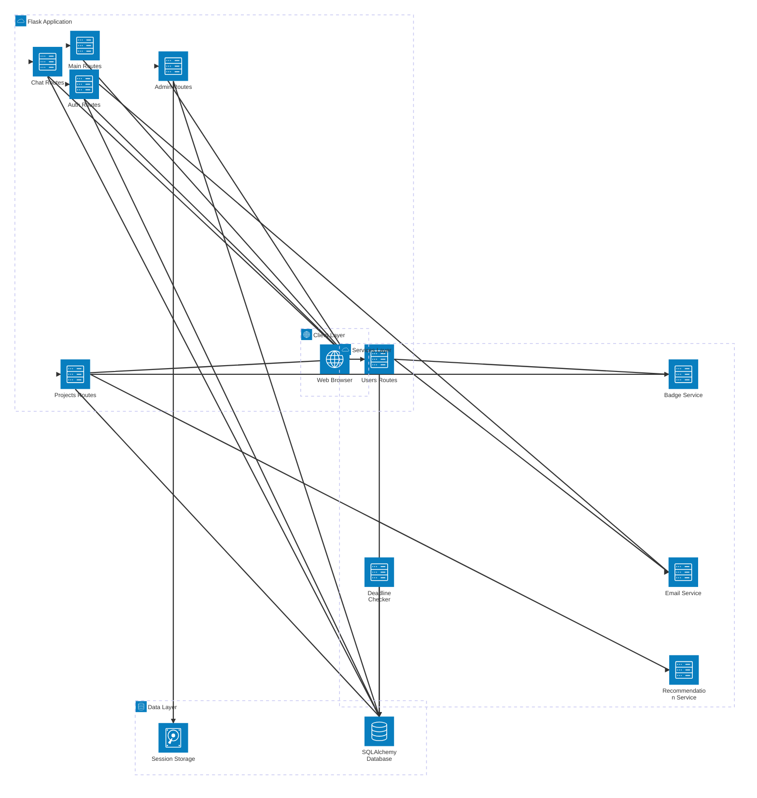
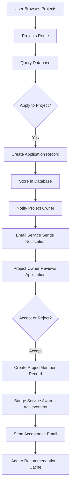

# ProjectBuddy - System Architecture

## Project Overview

ProjectBuddy is a university project collaboration platform where students and instructors can post projects, form teams, communicate, and provide peer feedback.

**Tech Stack:**
- Backend: Flask (Python)
- Database: SQLAlchemy ORM (SQLite/PostgreSQL)
- Frontend: HTML + CSS + JavaScript
- Authentication: Flask-Login + werkzeug

---

## System Architecture Diagram



---

## Layer 1: Client Layer

The frontend user interface running in web browsers.

- templates/ - HTML pages (Jinja2 templating)
- static/css/ - Styling and layout
- static/js/ - Interactive functionality
- static/images/ - UI assets

---

## Layer 2: Flask Routes (Business Logic)

| Route Module | Responsibility |
|---|---|
| auth.py | User registration, login, password reset |
| main.py | Home page, navigation, public endpoints |
| projects.py | Create, browse, apply to projects |
| users.py | User profiles, skill endorsements, feedback |
| chat.py | Real-time messaging between users and support |
| admin.py | Admin dashboard, user management, reports |
| email.py | Transactional and notification emails |

---

## Layer 3: Services Layer (Business Processes)

| Service | Function |
|---|---|
| Badge Service | Award achievements based on user activity |
| Recommendation Service | Suggest projects based on user interests |
| Deadline Checker | Monitor project deadlines and send reminders |
| Email Service | Send notifications and transactional emails |

---

## Layer 4: Data Layer (Database & Models)

**Core Database Models:**

- User - Account info, roles (student/instructor/admin), profile
- Project - Project listings with details, deadline, team size
- ProjectMember - Team membership tracking
- Application - User applications to join projects
- Feedback - Peer feedback and ratings
- Endorsement - Skill endorsements from peers
- UserBadge - Earned achievements
- UserInterest - Interest tags for recommendations
- UserSkill - Skills and expertise tracking
- Message - Chat messages within projects

**Database:** SQLite (development) or PostgreSQL (production)

---

## Data Flow Example: Applying to a Project



---

## User Roles and Permissions

**Admin**
- User management
- Report handling and moderation
- System-wide warnings and bans
- Analytics and statistics

**Instructor**
- Post and manage projects
- Manage team members
- Give peer feedback
- View project analytics

**Student**
- Browse projects
- Apply to projects
- Join teams
- Give and receive feedback
- Earn badges

---

## Key Architecture Features

**Authentication and Authorization**
- Password hashing with werkzeug
- Flask-Login session management
- Role-based access control (RBAC)
- Email-based identity verification

**Project Management**
- Project creation and posting
- Application system for joining
- Team member management
- Project deadline tracking with automated reminders
- Team chat for collaboration

**Reputation and Social Features**
- Badge system for achievements
- Skill endorsements from peers
- Project completion feedback and ratings
- User profile reputation scores

**Support and Moderation**
- Admin support chat
- Report submission system
- User warnings and account restrictions
- Content moderation dashboard

---

## Project File Structure

```
ProjectBuddy/
├── app.py                  # Flask app factory and initialization
├── config.py               # Environment configuration
├── extensions.py           # Flask extensions setup
├── models.py               # Database models
├── requirements.txt        # Python dependencies
│
├── routes/                 # Route handlers
│   ├── __init__.py
│   ├── auth.py            # Authentication endpoints
│   ├── main.py            # Home and navigation
│   ├── projects.py        # Project CRUD operations
│   ├── users.py           # User profiles and endorsements
│   ├── chat.py            # Messaging system
│   ├── admin.py           # Admin dashboard
│   └── email.py           # Email sending
│
├── services/              # Business logic services
│   ├── badge_service.py       # Badge award logic
│   ├── recommendation_service.py  # Project recommendations
│   ├── deadline_checker.py    # Deadline monitoring
│   ├── bootstrap_service.py   # System initialization
│   └── mock_data.py           # Sample data for testing
│
├── templates/             # HTML templates
│   ├── base.html          # Base template
│   ├── auth.html          # Login and Registration
│   ├── dashboard.html     # User dashboard
│   ├── projects.html      # Project listings
│   ├── project_detail.html
│   ├── admin_dashboard.html
│   └── ... (16 total templates)
│
├── static/                # Static assets
│   ├── css/
│   │   └── style.css      # Stylesheet
│   ├── js/
│   │   └── main.js        # JavaScript functionality
│   └── images/            # UI images
│
├── scripts/               # Utility scripts
│   ├── init_db.py         # Initialize database
│   ├── create_admin.py    # Create admin user
│   └── mock.py            # Load sample data
│
├── logs/                  # Application logs
├── instance/              # Instance-specific files
└── README.md              # Project documentation
```

---

## Getting Started

1. Clone or download the project
2. `python -m venv venv` and activate it
3. `pip install -r requirements.txt`
4. `cp .env.example .env` and fill in secrets (never commit `.env`)
5. Run: `python app.py` (creates DB, admin, optional mock data on first start)
6. Open: `http://localhost:5001` (or your `PORT` in `.env`)

Optional: `flask db upgrade` after pulling new migrations; `python scripts/create_admin.py` if admin was not created.

---

## Key Dependencies

- Flask - Web framework
- SQLAlchemy - ORM for database
- Flask-Login - User session management
- Flask-Mail - Email sending
- Werkzeug - Utilities for authentication
