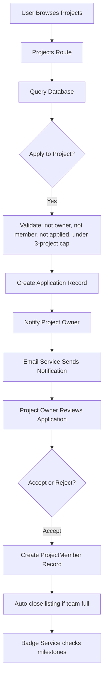

# ProjectBuddy - System Architecture

## Project Overview

ProjectBuddy is a university project collaboration platform where students and instructors can post projects, form teams, communicate, and build a verified reputation.

**Live:** [https://project-buddy-pb.onrender.com](https://project-buddy-pb.onrender.com)

**Tech Stack:**
- Backend: Python 3.9 · Flask 3.1
- Database: SQLAlchemy 2.0 ORM (SQLite dev / PostgreSQL prod)
- Frontend: Jinja2 · HTML · CSS · JavaScript
- Real-time: Flask-SocketIO + eventlet · WebRTC (voice)
- Auth: Flask-Login · GitHub OAuth (HMAC-signed state)
- Email: Brevo HTTP API (transactional email, bypasses cloud SMTP restrictions)
- File Storage: Local disk (dev) · AWS S3 (prod)
- Cache / Queue: Redis (rate limiting + SocketIO multi-worker + voice state)
- Scheduler: APScheduler (deadline auto-complete, every 1h)
- Security: CSRF (Flask-WTF) · CSP nonces · HSTS · security headers

---

## System Architecture Diagram


---

## Layer 1: Client Layer

The frontend user interface running in web browsers.

- `templates/` — HTML pages (Jinja2 templating, CSP nonce-aware)
- `static/css/` — Styling and layout
- `static/js/` — Interactive functionality
- `static/images/` — UI assets

---

## Layer 2: Flask Routes (Business Logic)

| Route Module | Responsibility |
|---|---|
| `auth.py` | Registration, login, GitHub OAuth (HMAC state), password reset |
| `main.py` | Dashboard, profiles, avatar upload, project UI |
| `projects.py` | Project CRUD, applications, feedback, skill endorsements |
| `users.py` | User search (no email exposure), public profiles (login-gated) |
| `chat.py` | User ↔ admin support chat |
| `community.py` | Community feed, posts (media upload), comments, likes, mentions |
| `study_groups.py` | Study groups, real-time chat, file upload/download |
| `voice.py` | WebRTC signaling via SocketIO (Redis-backed room state) |
| `chatbot.py` | AI assistant — Groq → Anthropic → keyword mock fallback |
| `admin.py` | Moderation, reports, bans, stats (all routes use @admin_required) |
| `email.py` | Transactional email via SMTP/STARTTLS |

---

## Layer 3: Services Layer (Business Processes)

| Service | Function |
|---|---|
| `badge_service.py` | Award badges on project completion and skill endorsement |
| `recommendation_service.py` | Project recommendations — ML model (A/B arm 'ml') or rule-based scorer (arm 'rules'/fallback) |
| `ml/` | Trained recommender: LSA embeddings, feature engineering, training with ranking metrics (recall@5, NDCG@10), serving |
| `analytics.py` | Product analytics: event tracking (`track()`), A/B assignment, DAU/WAU/MAU, funnel, retention cohorts, CTR per arm |
| `assistant_tools.py` | Chatbot RAG layer: semantic retrieval over live platform data + LLM function-calling registry |
| `metrics.py` | Prometheus `/metrics`: request RED metrics + domain gauges |
| `deadline_checker.py` | Auto-complete overdue projects — runs every 1h via APScheduler |
| `file_storage.py` | Upload abstraction: local disk (dev) or AWS S3 (prod) |
| `mock_data.py` | Seed realistic demo data on first run |

---

## Layer 4: Data Layer

**Core Database Models (25 total, SQLAlchemy 2.0):**

All models use `Mapped[type]` + `mapped_column` (full SQLAlchemy 2.0 syntax). All timestamps use `datetime.now(timezone.utc)`.

| Model | Description |
|---|---|
| `User` | Account, roles (student/instructor/admin), profile |
| `Project` | Listings with tags, skills, deadline, team size |
| `ProjectMember` | Team membership with soft-delete (removed flag) |
| `Application` | Join requests with status |
| `Feedback` | Peer ratings (1-5, DB-level CheckConstraint) |
| `Endorsement` | Skill endorsements (requires shared completed project) |
| `Badge` / `UserBadge` | Achievement system |
| `Report` | User/project reports with moderation status |
| `Chat` / `ChatMessage` | Support chat between users and admins |
| `CommunityPost` / `CommunityComment` / `CommunityLike` | Social feed |
| `StudyGroup` / `StudyGroupMember` / `StudyGroupMessage` | Study rooms |
| `SharedFile` | File metadata for study group uploads |
| `Notification` | In-app notification feed |
| `ActivityEvent` | Append-only analytics event stream (logins, views, applications, rec impressions/clicks with A/B arm) |
| `PasswordReset` | Token-based reset (24h expiry) |
| `ChatbotSession` | AI conversation history (last 20 turns per user) |

**Database:** SQLite (dev) / PostgreSQL (prod)
**Migrations:** Flask-Migrate (Alembic) — production runs `flask db upgrade` on startup

---

## Security Architecture

| Layer | Implementation |
|---|---|
| Passwords | `pbkdf2:sha256` via Werkzeug |
| Sessions | `__Host-` prefix cookie, HttpOnly, SameSite=Lax, 8h lifetime |
| CSRF | Flask-WTF global protection, failure → flash + redirect |
| CSP | Per-request nonce (`secrets.token_urlsafe(16)`), no `unsafe-inline` |
| Rate Limiting | Flask-Limiter per IP — Redis backend (prod), memory (dev) |
| OAuth State | HMAC-SHA256 signed timestamp, `hmac.compare_digest` verification |
| Security Headers | X-Content-Type-Options, X-Frame-Options, Referrer-Policy, HSTS (prod) |
| Access Control | `@login_required` + `@admin_required` decorators |
| File Uploads | Extension whitelist + Content-Type check + magic-byte sniff + size cap |

---

## Data Flow Example: Applying to a Project



---

## User Roles and Permissions

**Admin**
- Full platform access via `@admin_required` decorator
- User management, warnings, bans
- Report handling and moderation
- Analytics, stats, chatbot log inspection

**Instructor**
- Post and manage projects
- Manage team members and give peer feedback

**Student**
- Browse and apply to projects (max 3 active)
- Join teams, give and receive feedback
- Earn badges through activity

---

## Project File Structure

```
ProjectBuddy/
├── app.py                  # App factory, security headers, CSP nonces, APScheduler
├── config.py               # Dev / Test / Prod config classes
├── extensions.py           # Flask extensions + admin_required decorator
├── models.py               # 25 SQLAlchemy 2.0 models
├── wsgi.py                 # Production entry point (gunicorn + eventlet)
├── requirements.txt        # Python dependencies
├── .env.example            # Environment variable template
│
├── routes/
│   ├── auth.py             # Auth, GitHub OAuth, password reset
│   ├── main.py             # Dashboard, profiles, avatar upload
│   ├── projects.py         # Projects, applications, feedback, endorsements
│   ├── users.py            # Search, public profiles
│   ├── chat.py             # Support chat
│   ├── community.py        # Feed, posts, media upload
│   ├── study_groups.py     # Study groups, file upload/download
│   ├── voice.py            # WebRTC signaling (Redis-backed state)
│   ├── chatbot.py          # AI assistant
│   ├── admin.py            # Admin panel (@admin_required on all routes)
│   └── email.py            # SMTP email
│
├── services/
│   ├── badge_service.py            # Event-driven badge awards
│   ├── recommendation_service.py   # Interest tag matching
│   ├── deadline_checker.py         # Auto-complete overdue projects
│   ├── file_storage.py             # Local / S3 storage abstraction
│   └── mock_data.py                # Demo data seeding
│
├── templates/              # Jinja2 templates (all script/style tags have CSP nonces)
├── static/                 # CSS, JS, images
├── migrations/             # Alembic migrations (single source of truth in prod)
└── logs/                   # Rotating application logs (10MB × 10 files)
```

---

## Getting Started

1. Clone: `git clone https://github.com/ssaaffaakk/Project-buddy-Pb.git`
2. Create venv: `python -m venv venv && source venv/bin/activate`
3. Install deps: `pip install -r requirements.txt`
4. Configure: `cp .env.example .env` — fill in `SECRET_KEY`, `ADMIN_EMAIL`, `ADMIN_PASSWORD`
5. Migrate: `flask db upgrade`
6. Run: `python app.py` → open `http://localhost:5001`

On first run: database schema applied, admin account created, mock data seeded (if `SEED_MOCK_DATA=true`).

---

## Key Dependencies

| Package | Purpose |
|---|---|
| Flask 3.1 | Web framework |
| SQLAlchemy 2.0 | ORM |
| Flask-Migrate | Alembic migrations |
| Flask-Login | Session management |
| Flask-Limiter | Rate limiting |
| Flask-WTF | CSRF protection |
| Flask-SocketIO | WebSocket / real-time |
| eventlet | Async I/O for SocketIO |
| APScheduler | Background task scheduler |
| boto3 | AWS S3 file storage |
| redis | Redis client (rate limiter + SocketIO + voice state) |
| gunicorn | Production WSGI server |
| Werkzeug | Password hashing, file utilities |
